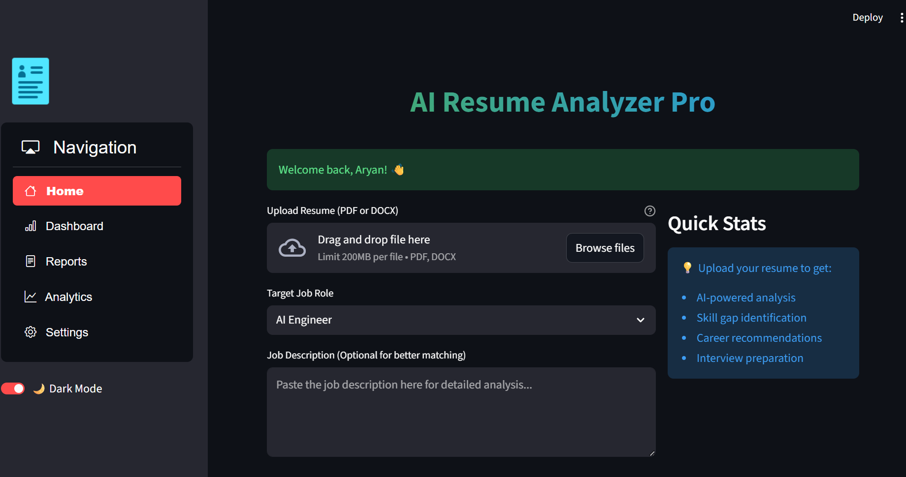
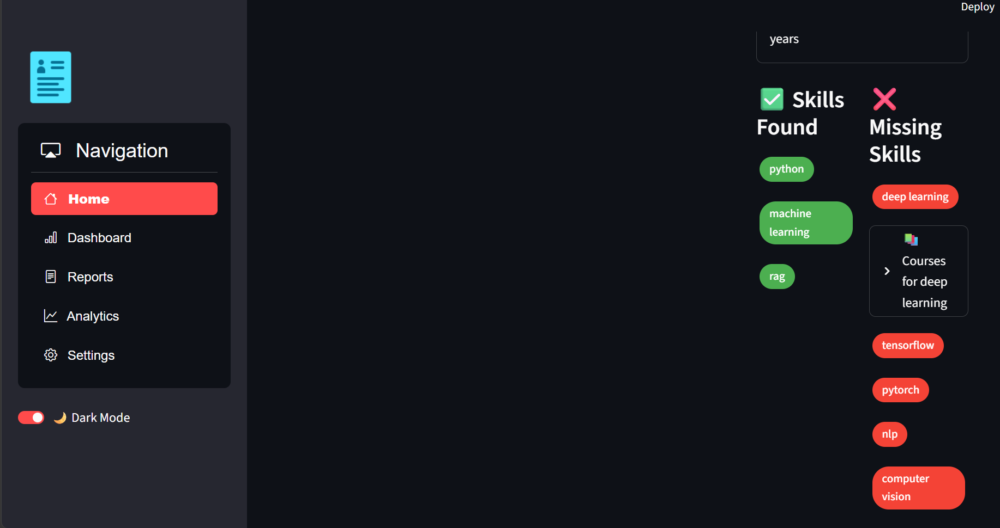
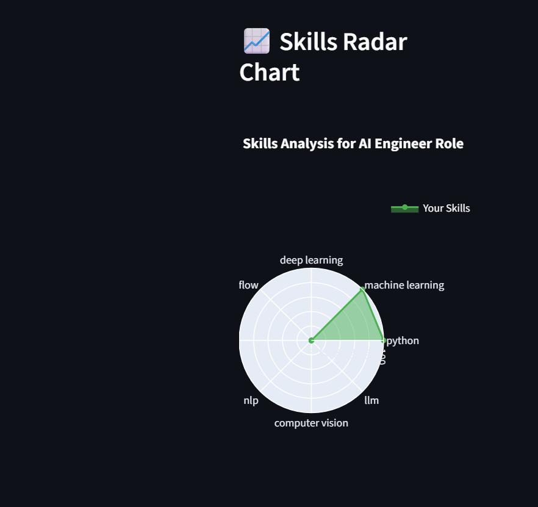
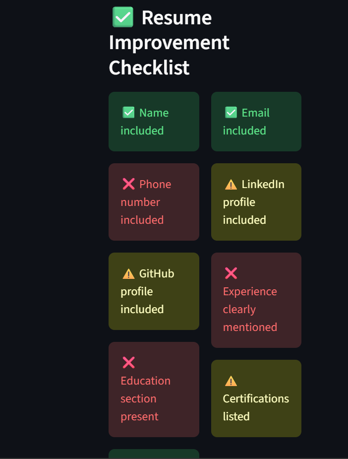
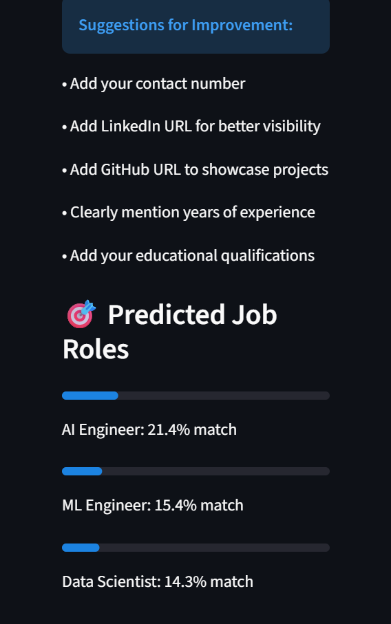
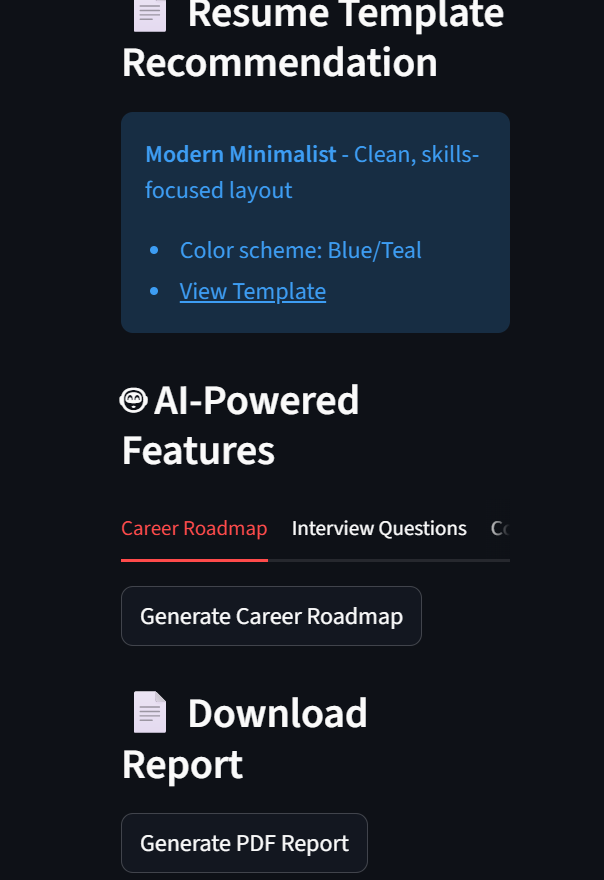
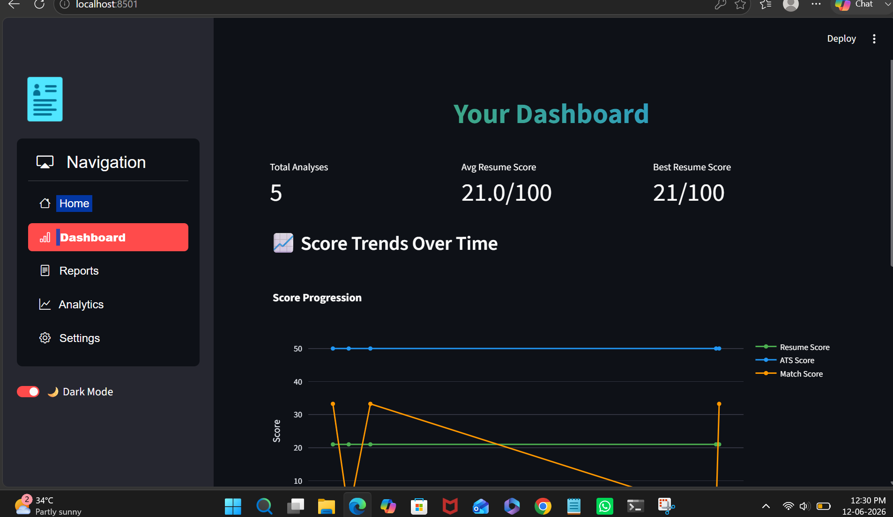

# AI Resume Analyzer 🤖

An AI-powered Resume Analyzer built using Python, Streamlit, Machine Learning, and Google Gemini API.

## Features

* Resume PDF Upload
* Skill Extraction
* ATS Score Analysis
* Resume Match Score
* Missing Skills Detection
* AI-Powered Resume Feedback
* Skill Visualization Charts

## Tech Stack

* Python
* Streamlit
* Scikit-Learn
* PyPDF2
* Matplotlib
* Google Gemini API

## Future Improvements

* Multiple Resume Templates
* Resume Ranking System
* Job Recommendation Engine
* Downloadable PDF Reports

## Author

Aryan Nasina
AI & Data Science Student
## Screenshots

